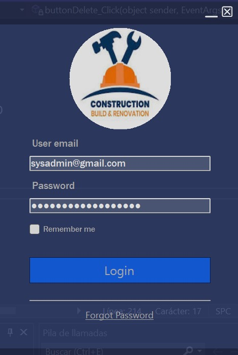

# CompanyProject
In this project we are going to make a quick overview of how to connect applications with different languages to an api and from there communicate with a database.

## First steps to follow: 
### - We will use mysql as data manager where we will create a table for users
### - We will use .NET 8 to create the api in c#.
### - We will use a small program in c# to manage users

## Why use ASP.NET
ADVANTAGES:
- Multiplatform: Works on Windows, Linux and macOS.
- High performance: It is known for its high performance and scalability.
- HTTP request handling: It is ideal for building services that handle HTTP requests, such as RESTful APIs.
- Database integration: You can use Entity Framework Core to connect your API to SQL or NoSQL databases easily.

## How to install [.Net SDK](https://dotnet.microsoft.com/es-es/download)
- cmd dotnet new webapi -n MiApiCompany
- cmd cd MiApiCompany

Now try to run it:
- cmd dotnet run --> Now go to http://localhost:5277/swagger/index.html

## Packages to download
- Microsoft.EntityFrameworkCore.MySql: This package is required to work with MySQL. --> dotnet add package Microsoft.EntityFrameworkCore.MySql
- Microsoft.EntityFrameworkCore.Tools: Provides tools for migrations and other operations related to EF Core. --> dotnet add package Microsoft.EntityFrameworkCore.Tools
- For my desktop application I will use c# and we will have to download the newtonsoft for communication with the api --> dotnet add package Newtonsoft.Json
- Note that if you want to make a copy of your database to a .sql file you can use --> mysqldump -u username -p database_name > backup_file.sql OR mysqldump -u root -p mi_base_de_datos > mi_base_de_datos_backup.sql :D
